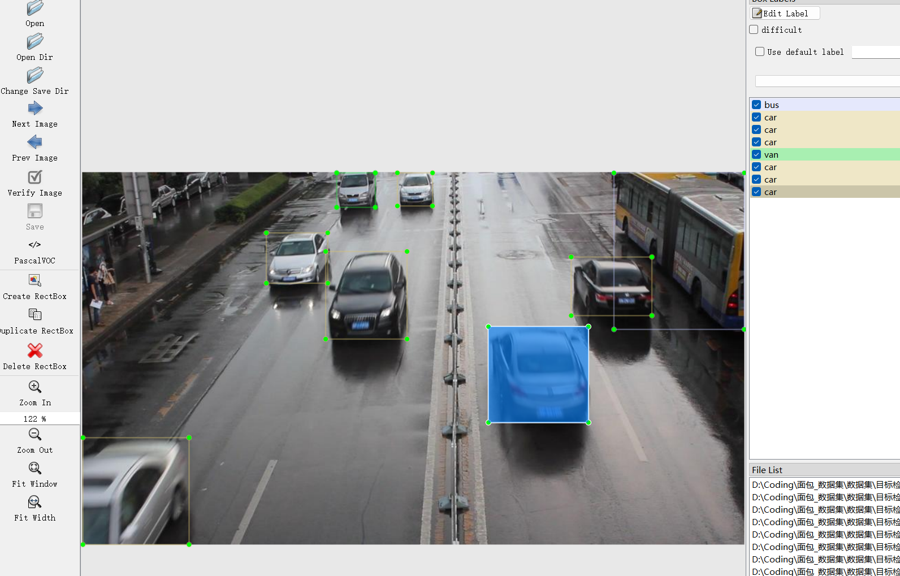

# Vehicle-Target Detection Dataset

Dataset Information Introduction: This dataset consists of 37,850 images and corresponding annotation files. The annotation files are in two formats: VOC formatted XML files and YOLO formatted txt files. The objects to be detected include 'car', 'van', and 'bus'. The number of bounding box information is as follows: (The English labels provided inside the brackets are for reference when annotating.)

Note: An image may contain multiple objects, so the total number of bounding boxes might be greater than the total number of images.

all_images File: Stores the dataset images, with screenshots as follows:
Image size information:

all_txt folder and classes.txt: Stores the yolo formatted txt annotation files, in the same quantity as the images, each annotation file corresponds to one image.
classes.txt:
For a detailed understanding of the standard yolo format, please search on your own. In short, the index 0 represents the name at the array position 0 in the classes.txt file.

all_xml File: VOC formatted XML annotation files. The quantity and images are the same, each annotation file corresponds to one image.
For a detailed understanding of the standard VOC format, please search on your own. Both formats can be used, choose one based on your preference.
Annotation effect screenshots:

## Image

Here is a pay link on Stripe ( https://buy.stripe.com/3cs8yP7sY87d0vu9AB ). Please contact me lonlonago@foxmail.com after funding $89, and I will send you a complete data files , thank you!

